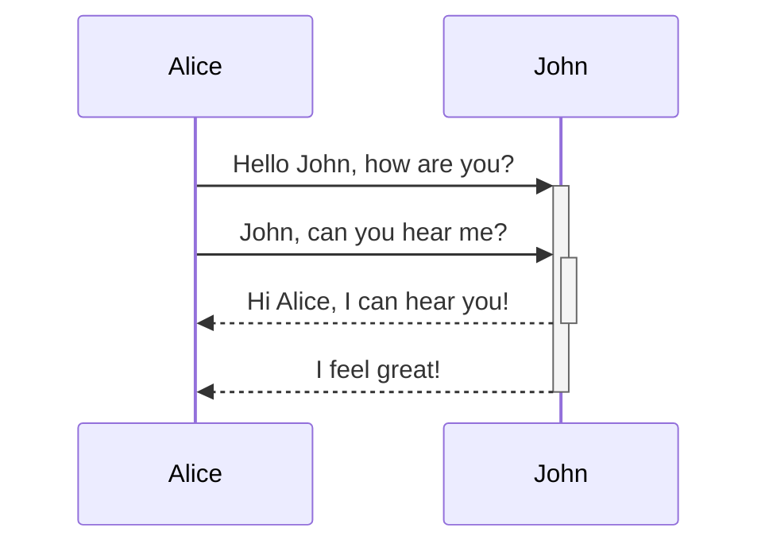

# Advanced Syntax Markdown

## Diagram

### A mermaid code block



## Math (Latex notation)

### MathJax expression

$$
\begin{vmatrix}a & b\\
c & d
\end{vmatrix}=ad-bc
$$

### Inline

This is an inline math expression $e^{2i\pi} = 1$.

## Emoji

That is so funny! :joy:

(See also [Copying and Pasting Emoji](https://www.markdownguide.org/extended-syntax/#copying-and-pasting-emoji))

## Another Styling Text

### Highlight

:star: Use `<mark></mark>`

I need to highlight these <mark>very important words</mark>.

### Subscript

:star: Use `<sub></sub>`

H<sub>2</sub>O

### Superscript

:star: Use `<sup></sup>`


X<sup>2</sup>

## Difference Commits

```diff
- this code or text is the old version
+ this is what it was changed to
```
